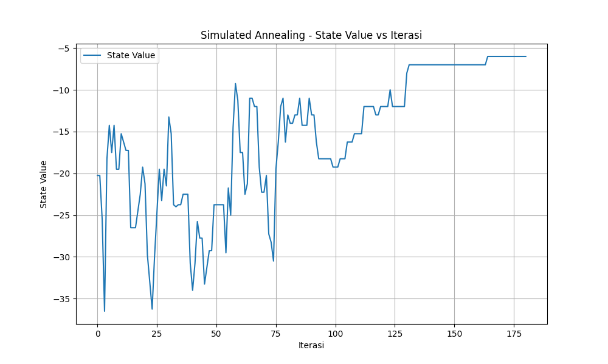
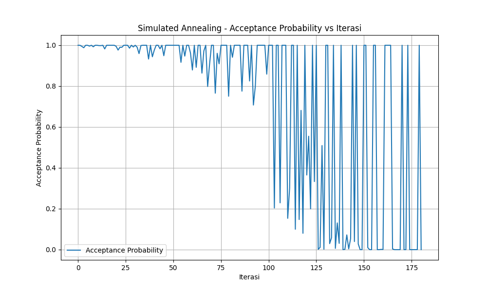

# Tugas Besar 1 IF3170 Inteligensi Buatan: Pencarian Solusi Penjadwalan Kelas Mingguan Dengan Local Search 

## Deskripsi

Program ini adalah sistem optimasi penjadwalan kuliah mingguan yang menggunakan algoritma **Local Search** untuk menemukan solusi optimal. Sistem ini dirancang untuk menyelesaikan permasalahan penjadwalan mata kuliah ke ruangan dan waktu yang tersedia dengan meminimalkan konflik dan pelanggaran constraint.

### Fitur Utama:
- **Tiga Algoritma Optimasi**: Hill Climbing, Simulated Annealing, dan Genetic Algorithm
- **Input Fleksibel**: Mendukung input dalam format JSON
- **Visualisasi Hasil**: Menampilkan grafik progress optimasi dan acceptance probability
- **Export Hasil**: Menyimpan jadwal hasil optimasi ke file teks dan gambar plot
- **Analisis Lengkap**: Menampilkan perbandingan jadwal awal vs hasil optimasi

### Constraint yang Diperhatikan:
1. **Room Conflict**: Tidak ada dua mata kuliah yang dijadwalkan di ruangan yang sama pada waktu yang sama
2. **Time Conflict**: Mahasiswa tidak memiliki bentrok jadwal mata kuliah
3. **Lecturer Conflict**: Dosen tidak mengajar dua mata kuliah berbeda pada waktu yang sama
4. **Room Capacity**: Jumlah mahasiswa tidak melebihi kapasitas ruangan
5. **Lecturer Preference**: Preferensi waktu mengajar dosen dipertimbangkan

## Spesifikasi yang Dikerjakan

### 1. Hill Climbing ***[BONUS]***
Implementasi lengkap dengan 4 varian:
- **Steepest Ascent Hill Climbing**: Memilih successor terbaik dari semua kemungkinan
- **Hill Climbing with Sideways Move**: Mengizinkan gerakan lateral untuk menghindari plateau
- **Stochastic Hill Climbing**: Memilih successor secara random dari yang lebih baik
- **Random Restart Hill Climbing**: Restart dari state random jika terjebak di local optimum

### 2. Simulated Annealing
Implementasi dengan fitur lengkap:
- **Temperature Schedule**: Cooling rate yang dapat dikonfigurasi
- **Acceptance Probability**: Implementasi Boltzmann distribution untuk menerima solusi lebih buruk
- **Dynamic Temperature**: Temperature turun secara eksponensial
- **Visualisasi**: Grafik acceptance probability vs iterasi

### 3. Genetic Algorithm
Implementasi algoritma genetika:
- **Selection**: Tournament selection untuk memilih parent
- **Crossover**: Single-point crossover untuk menghasilkan offspring
- **Mutation**: Random mutation untuk menjaga diversity
- **Population Management**: Manajemen populasi dengan size yang dapat dikonfigurasi

### 4. Fitur Tambahan
- **State Representation**: Struktur data efisien menggunakan dictionary ***[WAJIB]***
- **Objective Function**: Fungsi evaluasi multi-constraint ***[WAJIB]***
- **Initial State Display**: Menampilkan jadwal sebelum optimasi ***[WAJIB]***
- **Final State Display**: Menampilkan jadwal hasil optimasi ***[WAJIB]***
- **Performance Metrics**: Tracking iterasi, waktu eksekusi, dan improvement ***[WAJIB]***
- **Dosen sebagai Constraint Tambahan** : data Dosen dalam JSON memiliki aturan tambahan ***[BONUS]***
- **File Export**: Save hasil ke file .txt dan grafik ke .png ***[BONUS]***

## Cara Run

### 1. Install Dependencies
```bash
pip install -r requirements.txt
```

### 2. Jalankan Program
```bash
python run.py
```

### 3. Ikuti Prompt Interaktif
Program akan meminta:
1. **Path file JSON**: Masukkan path ke file data (contoh: `data/sample_input.json`)
2. **Pilih Algoritma**: Ketik `HC`, `SA`, atau `GA`
3. **Konfigurasi Parameter**: Masukkan parameter sesuai algoritma yang dipilih

### Contoh Konfigurasi

#### Hill Climbing
- Variant: Pilih 1-4 (Steepest/Sideways/Stochastic/Random Restart)
- Max Sideways: 10-20 (untuk variant Sideways)
- Max Iteration: 100-1000 (untuk variant Stochastic)
- Max Restart: 5-10 (untuk variant Random Restart)

#### Simulated Annealing
- Initial Temperature: `1000.0` 
- Cooling Rate: `0.995` 
- Stop Temperature: `0.01` 

#### Genetic Algorithm
- Population Size: `100` 
- Max Iteration: `100` 

## Contoh Hasil Akhir

### Output Console

```
===============================================================================
SISTEM OPTIMASI PENJADWALAN KULIAH
================================================================================
Masukkan path file JSON: data/data_baru.json

Pilih Algoritma:
1. Hill Climbing (HC)
2. Simulated Annealing (SA)
3. Genetic Algorithm (GA)
Pilihan (HC/SA/GA): SA

Memulai optimasi penjadwalan...

==================================================
KONFIGURASI SIMULATED ANNEALING
==================================================
Initial Temperature (terakhir cek 1000.0): 1000
Cooling Rate (terakhir cek 0.95): 0.995
Stop Temperature (terakhir cek 0.1): 0.01

Parameter Simulated Annealing:
    Initial Temperature: 1000.0
    Cooling Rate: 0.995
    Stop Temperature: 0.01

Memulai Simulated Annealing...
    Initial Temperature: 1000.0
    Initial State Value: -284.00
    Iterasi 100, Temperature: 605.77, State Value: -264.50
    Iterasi 200, Temperature: 366.96, State Value: -263.75
    ...
    Iterasi 2,200, Temperature: 0.02, State Value: 0.00

Simulated Annealing selesai!
    Final Temperature: 0.0100
    Final State Value: 0.00
    Total Iterasi: 2,297
    Waktu Eksekusi: 2.242 detik
```

### Informasi Hasil Optimasi

```
================================================================================
HASIL OPTIMASI PENJADWALAN KULIAH
================================================================================
+=============================================+
|              INFORMASI OPTIMASI             |
+=============================================+

+---------------------------------------------+
|              PARAMETER & HASIL              |
+---------------------------------------------+
|  Algoritma           : Simulated Annealing  |
|  Initial Temperature :             1000.00  |
|  Cooling Rate        :              0.9950  |
|  Stop Temperature    :              0.0100  |
|  Waktu Eksekusi      :         2.242 detik  |
|  Jumlah Iterasi      :               2,297  |
|  State Value Awal    :             -284.00  |
|  State Value Akhir   :                0.00  |
|  Peningkatan         :             +284.00  |
|  Stuck Frequency     :                2047  |
+---------------------------------------------+
```

### Jadwal Initial State (Sebelum Optimasi)

```
JADWAL INITIAL STATE
================================================================================

JADWAL RUANGAN (INITIAL): 7601
================================================================================
+-----+------------+------------+------------+------------+------------+
| Jam |   Senin    |   Selasa   |    Rabu    |   Kamis    |   Jumat    |
+=====+============+============+============+============+============+
| 7   |            |            | IF3130_K01 |            |            |
| 8   | IF3140_K01 |            |            | IF3150_K01 | IF3140_K18 |
| 9   |            |            | IF3071_K01 |            | IF3150_K01 |
| 10  | IF3230_K01 |            |            |            | IF3230_K01 |
| 11  | IF3071_K16 |            |            |            |            |
| 12  |            |            |            |            |            |
| 13  |            |            | IF3071_K01 |            | IF3071_K16 |
| 14  | IF3140_K14 |            | IF3140_K15 |            |            |
| 15  |            |            |            | IF3120_K01 | IF3230_K12 |
| 16  |            |            |            |            |            |
| 17  |            | IF3140_K15 | IF3130_K18 |            |            |
+-----+------------+------------+------------+------------+------------+

*Kolom jam di output merupakan jam mulai
```

### Jadwal Final (Hasil Optimasi)

```
JADWAL HASIL OPTIMASI
================================================================================

JADWAL RUANGAN (FINAL): 7601
================================================================================
+-----+------------+------------+------------+------------+------------+
| Jam |   Senin    |   Selasa   |    Rabu    |   Kamis    |   Jumat    |
+=====+============+============+============+============+============+
| 7   |            |            | IF3150_K11 |            |            |
| 8   |            |            |            |            | IF3130_K01 |
| 9   | IF3230_K12 | IF3110_K02 |            | IF3130_K18 |            |
| 10  | IF3071_K01 | IF3140_K15 |            |            |            |
| 11  |            |            |            |            |            |
| 12  | IF3230_K01 |            |            |            |            |
| 13  |            |            |            | IF3140_K18 |            |
| 14  | IF3071_K16 |            |            | IF3140_K18 |            |
| 15  |            |            | IF3230_K01 |            | IF3120_K01 |
| 16  |            |            |            |            |            |
| 17  |            |            |            |            | IF3150_K11 |
+-----+------------+------------+------------+------------+------------+

*Kolom jam di output merupakan jam mulai
```

### Visualisasi Grafik

#### 1. State Value vs Iterasi
Menunjukkan progress optimasi dari state value awal (-284) menuju optimal (0):



**Analisis Grafik:**
- **Iterasi 0-50**: Eksplorasi tinggi, state value fluktuatif tinggi
- **Iterasi 50-100**: Mulai konvergen, fluktuasi berkurang
- **Iterasi 100-180**: Eksploitasi, mencapai solusi optimal dengan state value 0

#### 2. Acceptance Probability vs Iterasi
Menunjukkan probabilitas menerima solusi yang lebih buruk selama proses SA:



**Analisis Grafik:**
- **Iterasi 0-50**: Probability tinggi (0.8-1.0) - fase eksplorasi
- **Iterasi 50-150**: Probability turun bertahap (0.2-0.8) - fase transisi
- **Iterasi 150-180**: Probability mendekati 0 - fase eksploitasi

### Analisis Hasil

```
+========================================+
|            DETAIL INFORMASI            |
+========================================+

+----------------------------------------+
|            ANALISIS JADWAL             |
+----------------------------------------+
| Total Mata Kuliah: 21                  |
| Total Ruangan: 4                       |
| Total Assignment: 60                   |
| Kualitas Jadwal: Baik                  |
| Utilisasi Slot: 27.3%                  |
+----------------------------------------+
```

**Interpretasi:**
- **State Value: 0.00** → Tidak ada konflik atau pelanggaran constraint
- **Peningkatan: +284.00** → Improvement signifikan dari initial state
- **Iterasi: 2,297** → Konvergensi tercapai dalam waktu wajar
- **Waktu: 2.242 detik** → Performa eksekusi yang efisien

### File Output

Setelah optimasi selesai, program akan menawarkan untuk menyimpan hasil:

```
Simpan hasil ke file? (y/n): y

Hasil berhasil disimpan:
    File teks: results/hasil_simulated_annealing_1729458923.txt
    File plot: results/hasil_simulated_annealing_1729458923_plots.png

Proses penyimpanan selesai!
Semua file tersimpan di folder 'results/' dengan prefix: hasil_simulated_annealing_1729458923
```

## Kontributor

<p align="center">
  <table>
     <tr align="center">
        <td>
          <br>
          <b>Brian Ricardo Tamin</b><br>
          13523126
        </td>
        <td>
          <br>
          <b>Muhammad Nazih Najmudin</b><br>
          13523144
        </td>
        <td>
          <br>
          <b>Lukas Raja Agripa</b><br>
          13523158
        </td>
     </tr>
  </table>
</p>

---

<p align="center">
  <b>Program Studi Teknik Informatika</b><br>
  <b>Institut Teknologi Bandung</b><br>
  2025
</p>